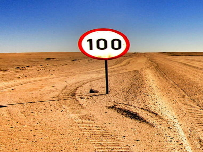
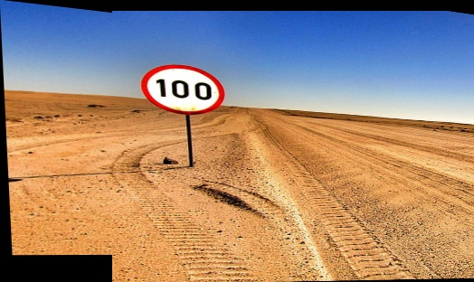

<h1 style="text-align: center;">Image Stitching</h1>

We are given two images of the same scene taken with a slight movement in the frame. We are tasked with stitching both the images together and create a single contiguous image. <br>

Image A         |  Image B
:-------------------------:|:-------------------------:
  |  
<br>

## Output: Stitched Image
<p align="center">
     

<br>

## Pipeline to perform the image stitching
1. Read images A and B separately
2. Using cv.Orb_create to create an orb detector object to extract points
3. Extract features (keypoints and descriptors) for each image separately
4. Using cv.BFMatcher_create to create a brute force object to match common features
between both images
5. Using K-nearnest neighbours method to find matching points. (Use two neighbours, k = 2)
6. Filtering out the good points, i.e matching points which are distinct enough
7. Now we compute homography between both the images
8. We set a minimun no. of points to connect both images to be 10 minimum good matching
points
9. If minimum number of points is satisfied, extract location of matched keypoints for the
source and destination images
10. Using the above created source and destination points perform homography using the
RANSAC algorithm
11. Find Reference coodinates of first image
12. Find reference coordinates of second image, which needs to be transformed
13. Performing perspective transform for image 1 to match with image 2
14. Join the coordinates along axis 0, i.e vertically
15. Calculate the translation distance needed to move the image for it to be stitched
16. Use cv.warpPerspective to warp image 1 accordingly
17. Stitch the first image with the second to get the final stitched image


## Usage
* Clone the repo to your local machine
```
git clone [insert GitHub link here]
```
* Change Directory
```
cd src
```
* Run the python file
```
python Image_Stitching.py
```

## Dependencies and libraries
1. Python 3.9.12
2. OpenCV '4.7.0'
3. Numpy '1.24.2'